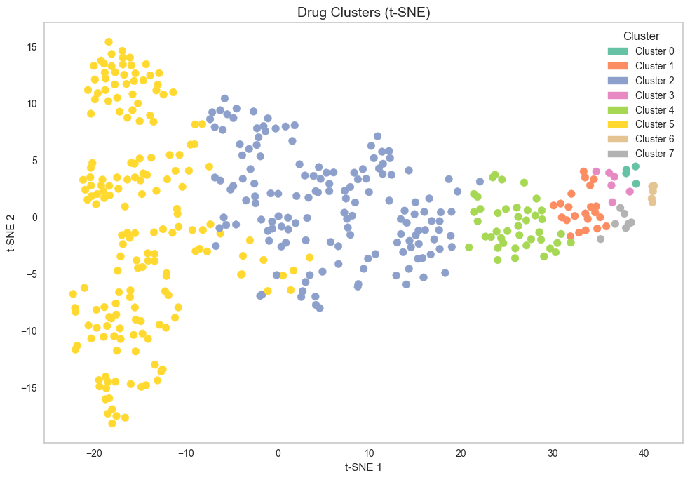
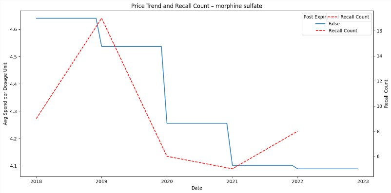
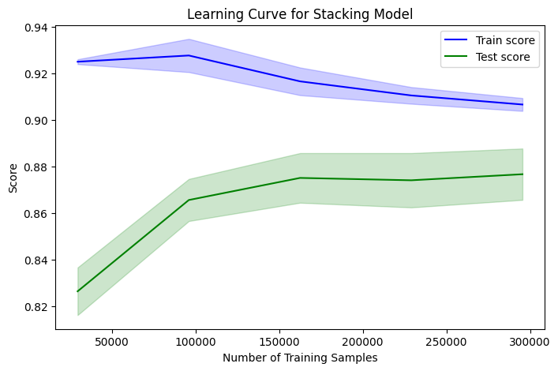

# Predicting Pharmaceutical Price Fluctuations
### The Impact of Patents and Regulatory Actions on Drug Pricing

Pharmaceutical pricing is a complex and critical component of healthcare economics, influenced by a combination of legal, regulatory, and market-driven factors. One of the most pivotal legislative influences on drug pricing has been the **Hatch-Waxman Act** (Drug Price Competition and Patent Term Restoration Act of 1984), which aimed to strike a balance between incentivizing pharmaceutical innovation and promoting the entry of lower-cost generics. While the Act has successfully accelerated generic competition and lowered costs for many medications, it has also introduced strategic patent extensions and regulatory bottlenecks that continue to affect price predictability.

Despite advancements in healthcare analytics, the process of forecasting drug prices remains largely opaque. Patent expirations, FDA regulatory actions (such as recalls and enforcement decisions), and evolving usage patterns all contribute to a dynamic pricing landscape. This unpredictability complicates planning for stakeholders like healthcare providers, insurers, and policymakers, making it difficult to manage budgets and ensure sustained access to essential medications.

This project aims to address these challenges by developing a **data-driven predictive model** that integrates variables such as patent status, regulatory events, and utilization behavior. The goal is to generate actionable insights that support more informed decision-making and enhance the affordability and accessibility of pharmaceuticals.

## Background 

Over the past two decades, several studies have explored drug pricing behavior in relation to patent expiry and generic entry. Prior research has shown that drug prices often drop significantly following the expiration of exclusivity rights, especially when multiple generics enter the market. However, the degree and timing of these changes vary widely by drug category, market conditions, and manufacturer strategies.

Similarly, literature examining regulatory actions—including FDA recalls, black-box warnings, and civil enforcement—suggests that such events can lead to both short-term volatility and long-term shifts in drug pricing. While some studies have modeled the impact of isolated factors like patent expiry or recall notices, few have comprehensively integrated multiple influences (e.g., patent data, regulatory interventions, and usage metrics) into a unified predictive framework.

This project bridges that gap by combining datasets from Medicare Part D, FDA’s Orange Book, and enforcement recall databases to create a robust model capable of forecasting pharmaceutical price fluctuations. By addressing both historical patterns and real-time regulatory dynamics, this research contributes a more holistic understanding of drug pricing behavior—supporting better forecasting, planning, and policy design.

## Research Objectives

1. **Clustering of Drugs Based on Characteristics and Pricing Behavior**  
Develop a method to group drugs based on factors like dosage, strength, and package size, enabling the identification of distinct pricing patterns and behaviors.

2. **Impact of Patent Expiry on Drug Prices**  
Explore the relationship between patent expirations and drug price fluctuations over time, providing insights into how patents influence pricing dynamics.

3. **Effect of Regulatory Actions on Price Volatility**  
Investigate the effect of regulatory actions such as recalls and enforcement on drug price volatility, and predict future price fluctuations post-recall or regulatory enforcement.


## Data Sources
The project leverages several key datasets to build a comprehensive model for predicting drug pricing patterns:

- **Medicare Part D Drug Spending Data (2018-2022)**: Provides detailed data on drug usage, spending, and claims, which is essential for understanding the relationship between drug prices and usage patterns in the U.S.
- **Medicare ACA Federal Upper Limits Data**: Used for federal pricing benchmarks and understanding pricing limits for drugs covered under Medicare.
- **FDA Orange Book Patent Data**: Contains information on drug patents, including expiration dates, helping us analyze the impact of patent expirations on drug pricing.
- **Drug Recall and Regulatory Data**: Includes data on FDA recalls, safety alerts, and enforcement actions that may affect drug prices and market stability.


## Key Findings


### 1. Drug Clustering Reveals Market Archetypes and Strategic Risk Zones



Using multidimensional clustering based on drug usage, cost, and manufacturer footprint, the model identified 8 key drug clusters:

| Cluster | Characteristics |
|---------|------------------|
| **0**   | Moderate AMP, fewer manufacturers; stable but sensitive to disruptions |
| **1**   | Low-cost, high-competition generics with broad usage |
| **2**   | Ultra-cheap critical drugs (e.g., albuterol) supporting public health |
| **3**   | High-AMP, low-usage specialty therapies for rare diseases |
| **4**   | Mid-range drugs for chronic conditions; essential and affordable |
| **5**   | Ultra-cheap, mass-use drugs (as low as $0.004) – key to routine care |
| **6**   | Premium rare disease treatments with limited manufacturer support |
| **7**   | Blockbuster generics like metformin – low cost, high demand |

These clusters act as a **market map** for identifying vulnerable drugs, pricing risks, and supply stability challenges.


### 2. Regulatory Recalls Influence Drug Pricing Behavior



A case study on **Morphine Sulfate** revealed a notable trend:  
As **FDA recall count** increased, the **average manufacturer price (AMP)** steadily declined.

This behavior suggests:
- Loss of market trust or quality perception  
- Temporary exits of major manufacturers  
- Market corrections from heightened competition during recall events  

This demonstrates that regulatory events can act as precursors or indicators of pricing behavior.


### 3. Policy & Research Implications

- Enables **price forecasting models** incorporating recall and patent variables  
- Helps **hospitals & insurers** plan procurement by predicting cost spikes  
- Supports **drug access policy** by pinpointing supply-chain-sensitive clusters  
- Encourages further research into **causal links** between recalls, patent expiries, and drug inflation  


## Results and evaluation

The regression models, particularly the **Random Forest Regression** and **Stacking Regressor**, demonstrated strong predictive capabilities in forecasting drug price fluctuations. The models trained on **AMP and Patent Data** consistently outperformed those using only the **Drug and AMP Data**, with better performance metrics, including R-squared and Mean Absolute Error (MAE). The inclusion of patent expiration features allowed the models to capture the nuanced impact of regulatory changes and market dynamics, leading to more accurate predictions. The **Stacking Regressor** model showed the best generalization performance, leveraging multiple base models to provide a robust prediction of drug price trends.



## Project Organization

```
├── data
│   ├── external       <- Inflation_rate.csv
│   ├── interim        <- amp_dataset.csv, drug_amp_dataset.csv, drug_dataset.csv, drug_patent_dataset.csv, patent_dataset.csv
│   ├── processed      <- model_drug_amp.csv, model_drug_patent.csv
│   └── raw            <- amp datasets, drug spending data (2018-2022); patent, product, exclusivity original data dump
│
├── models             <- trained models, predictions or model summaries
│
├── notebooks          <- Jupyter notebooks
│   └── future_work    <- in progress
|
├── references         <- Data dictionaries, manuals, and all other explanatory materials
│
├── reports            <- Generated analysis as HTML, PDF etc.
│   └── figures        <- Generated graphics and figures to be used in reporting
│
├── requirements.txt   <- The requirements file for reproducing the analysis environment
│
└── README.md          <- Project overview, setup instructions

```


## Limitations

### 1. Patent Expiry Timing Ambiguity
Although we used FDA Orange Book data, not all drugs have clearly defined or up-to-date patent expiration dates, making it difficult to fully model the patent-price relationship.

### 2. Model Generalizability
Our models are trained on Medicare Part D drug data, and the pricing behavior may differ in private insurance or retail pharmacy settings.

### 3. No Real-Time Monitoring or Automation
This project does not yet include a real-time pipeline to automatically update models with new regulatory events, limiting practical deployment in fast-changing scenarios.


## Future Work

1. **Regulatory Impact Analysis**  
   Further enhance the model by incorporating severity scoring of regulatory actions, using FDA classification levels to better quantify their impact on pricing.

2. **Competitive Pricing**  
   Integrate data on competitor and generic drug pricing post-patent expiry to model substitution effects and improve price prediction accuracy.

3. **Real-Time Data Integration**  
   Automate the updating of the model with live FDA data on drug shortages, recalls, and enforcement actions, ensuring predictions stay current and relevant.

4. **Advanced Clustering & Detection**  
   Implement time-series clustering for anomaly detection to identify unusual price shifts across drug groups, improving early detection of pricing trends.


## Installation & Usage

1. Clone the repository  
   `git clone https://github.com/Shirisha-18/pharmaceutical-drug-price-prediction`

2. Set up environment  
   `pip install -r requirements.txt`

3. Run notebooks step-by-step in `/notebooks` folder or _use main pipeline in `src/`_ (In progress)


## Acknowledgments 

- Thanks to our team members for their collaborative effort and contributions throughout the project.
- Special thanks to Professor Masoud Soroush for his valuable feedback and support.


## References

### Data Sources

  - [Medicare Part D Drug Spending](https://data.cms.gov/)
  - [FDA Orange Book Patent Data](https://www.accessdata.fda.gov/scripts/cder/ob/)
  - [Medicare ACA Federal Upper Limits](https://data.medicaid.gov/)


###  Tools & Libraries

- Jupyter Notebook for data exploration and modeling
- GitHub for collaboration and version control

### Research Papers

1. Bashaer, A., & Belal, A. (2023). Predicting medicine demand using deep learning techniques: A review. *Journal of Intelligent Systems*, [https://doi.org/10.1515/jisys-2022-0297](https://doi.org/10.1515/jisys-2022-0297).

2. Tomovic, A., & Atukeren, E. (2012). Long-term value creation in the pharmaceutical sector: an event study analysis of big pharma stocks. *International Journal of Sustainable Economics*, 4, 370–389. DOI: [10.1504/IJSE.2012.049609](https://www.researchgate.net/publication/264437189_Long-term_value_creation_in_the_pharmaceutical_sector_an_event_study_analysis_of_big_pharma_stocks).

3. Semen, B., Alexey, K., Elizaveta, K., & Leonid, Z. (2023). New drugs and stock market: a machine learning framework for predicting pharma market reaction to clinical trial announcements. *Scientific Reports*, 13(1), 12817. DOI: [10.1038/s41598-023-39301-4](https://doi.org/10.1038/s41598-023-39301-4).

4. Annual Reviews - Public Health [https://www.annualreviews.org/content/journals/10.1146/annurev-publhealth-040119-094305](https://www.annualreviews.org/content/journals/10.1146/annurev-publhealth-040119-094305).

5. Olson, L. M., & Wendling, B. W. (2013). *Estimating the effect of entry on generic drug prices using Hatch-Waxman exclusivity* (Working Paper No. 317). Bureau of Economics, Federal Trade Commission. Retrieved from [https://www.ftc.gov/sites/default/files/documents/reports/estimating-effect-entry-generic-drug-prices-using-hatch-waxman-exclusivity/wp317.pdf](https://www.ftc.gov/sites/default/files/documents/reports/estimating-effect-entry-generic-drug-prices-using-hatch-waxman-exclusivity/wp317.pdf)


